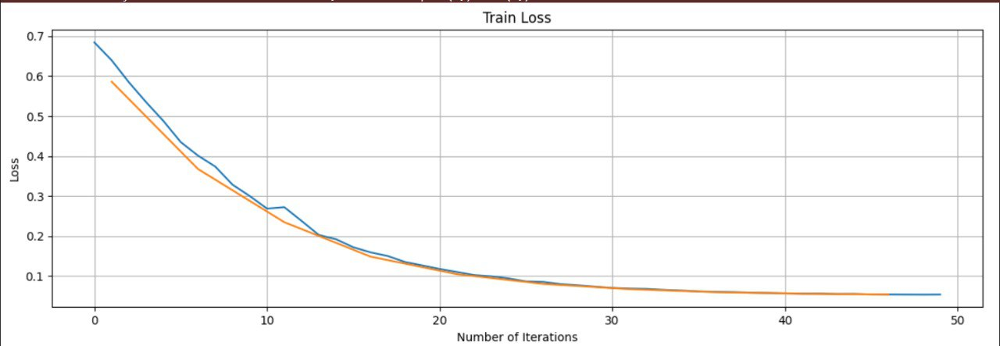
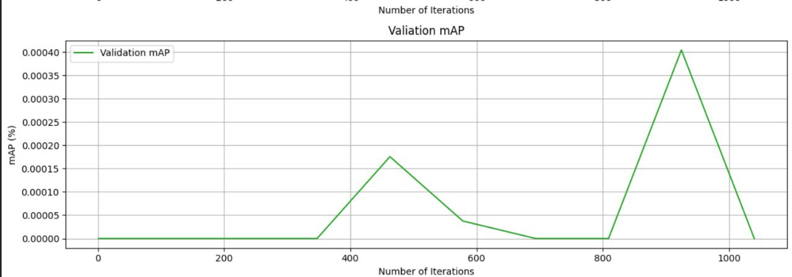
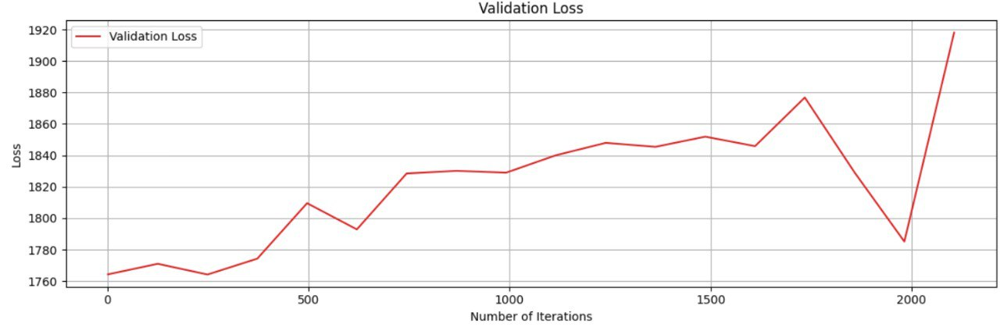
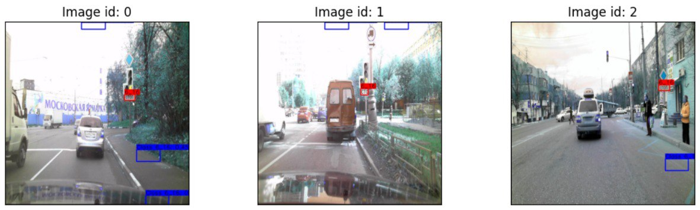
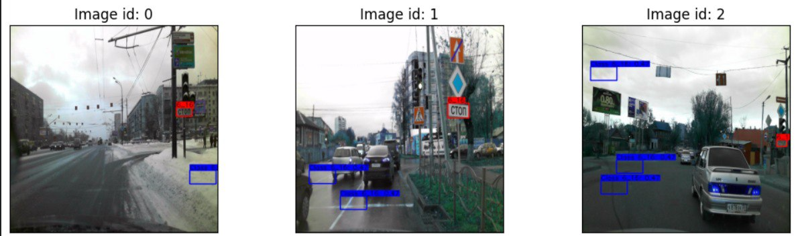
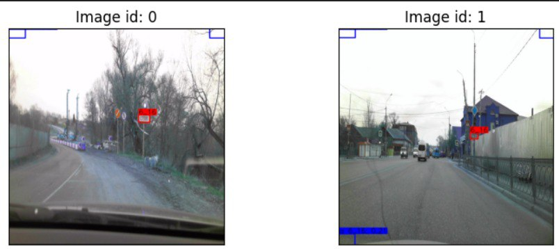
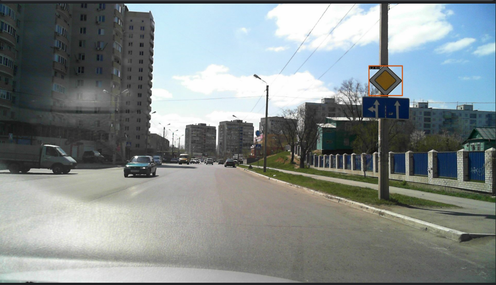

# Исследование и оценка методов на задаче детекции дорожных знаков

## Описание темы

Тема детекции дорожных знаков с камер автомобиля - очень распространенная и хорошо изученная область, однако эта область всё еще развивается. В наше время беспилотные автомобили только лишь начинают появляться на свет, а значит для дальнейшего развития области и получения надежных беспилотных автомобилей требуются проверенные методы детекции, хорошо обученные, быстрые и точные архитектуры, которые могут распознавать дорожные знаки при любых погодных условиях и даже при низком качестве изображений.

## Почему выбрал именно эту тему?

Долго не мог определиться и в течение двух недель вместе с другом анализировал сначалу про тепловое зрение, а после детекцию животных. Первая идея оказалась безперспективной. Для второй идеи я пытался обучить кастомную Faster R-CNN (ResNet-18), но модель оказалась слишком тяжелой для выбранного датасета (where-are-the-animals). Небольшие оптимизации не помогли решить OOM, хотя можно было оптимизировать модель и дальше.
Как раз к этому моменту в работу над своим проектом подключился друг, и после беседы с ним я решил не рисковать и работать над другой идеей. За 5 дней до делайна остановился на детекции дорожных знаков, как никак через неделю мне сдавать экзамены в ГАИ

## Какой подход к эксперименту использовал?

Подход заключался в применении на практике различных методов и архитектур, их сравнение на конкретной задаче, на конкретном датасете. Исследовать, что давало прирост в качестве, а что наоборот ухудшало.

## Какие данные взял?

Для исследования выбрал датасет RTSD-small (Russian Traffic Sign Detection): 2391 изображений, формат COCO, 155 знаков, несбалансированный, разрешения изображений от 1280×720 до 1920×1080, несколько объектов на одном изображении. Изображения после моей обработке масштабировались к 640x640, средний размер ббоксов после обработки - 18.1x30.4 пикселей. Получались очень маленькие ббоксы, меньше 16x16 пикселей, то есть меньше 256 пикселей для распознавания объекта, что довольно мало.

Самого лучшего результата на RTSD добилась команда из Антона Конюшина, Бориса Фаизова и Влада Шакуры с их моделью PVANet - 86.16% mAP

Далее разобью свой ход провальной работы на этапы:

## Первая этап

1) Подключил и предобработал датасет.
2) Перенес рабочий код из домашнего задания DLS по детекции моего знакомого, Вани и интегрировал его под свой датасет.
3) Небольшие доработки и изменения. Добавил в обучение три уровня для FPN, а не один. Добавил расчёт среднего размера якорей.
4) Неудачное обучение модели. Модель не обучалась. Трейн лосс стабильно падал, однако mAP был нулевым. Не знаю было ли это изначальной проблемой или эта проблема возникла после моих некорректных изменений, но лосс начал ломаться из nan значений.
5) Далее я исследовал этот nan феномен и все-таки нашел источник проблемы - некорректные размеры якорей. Высота или ширина некоторых якорей после decode_boxes становилась отрицательной, т.е x_max - x_min < 0 или y_max - y_min < 0. Я добавил ограничения в decode_boxes, но nan не исчезли. А это еще при том что сама модель скорее всего не обучалась по другой причине.
6) В пятницу в панике я забросил модель Вани и взял рабочую модель своего друга, Ильи.

Из положительных результатов только падающий лосс:

## Второй этап

1) С утра я быстренько интегрировал код Ильи, написанный под YOLO формат с нормализованными ббоксами, под свой датасет.
2) Обучение шло нормально, без nan, но как выяснилось модель тоже не обучается.
3) Исправление багов связанных с перехода с YOLO на COCO.
4) Модель все равно не обучается, но к счастью mAP хотя бы сдвинулся с нуля до около нулевых значений.

Также выяснил, что валидационный лосс растёт:

5) Вечером я пытался выяснить причину неправильного обучения. Однако исправить ситуацию не получилось. За это время попробовал кучу запусков разными методами:
- Увеличил разрешение изображений с 640x640 до 1280x1280. Значения валидационного лосса выросли в два раза, пропорционально увеличению изображения.
- Уменьшил weight_box с 10 до 1. Это тоже повлиляло на масштаб валидационного лосса. Значениями валидационного лосса уменьшились в 9 раз.
- Ограничил датасет одним классом. Модель не может даже правильно переобучиться на обучающих данных. После 240+ эпох на 42 изображениях знака "Стоп" модель научилась в точности повторять форму знака, но при этом двигала ббоксы в углы изображения.

После 140 эпох:

После 240+ эпох:

## Третий этап

1) Ночью и утром в панике пришлось брать другую идею. Решил провести простую серию экспериментов с mmdetection, которую я уже несколько раз видел в статьях по детекции
2) Планировал выполнить 10 разных запусков SSD до конца дедлайна. Однако столкнулся со сложностями фреймворка и конфликтами версий.
3) В 16:33 PM мне удалось запустить mmdetection на Kaggle с помощью кода из туториала https://medium.com/@kailaspsudheer/mmdetection-3x-training-and-customizing-models-7d5f24ed5ec1. Этот туториал самый свежий и самый подробный из всех четырёх, которых я находил
4) Интеграция кода под датасет
5) Успешное обучение RetinaNet:

6) Однако несмотря на использование готовой архитектуры mAP очень низкий 0.0820, можно попробовать улучшить:
- Веса модели и используемые конфиги я загрузил на свой гугл диск https://drive.google.com/drive/folders/1LNlnc1Mg-W1aWMuNq703NW6WNHwa3Fzm?usp=sharing.
- С аугментациями от автора я получил 0.082 mAP.
- Без аугментаций (оставил только масштабирование к 640x640) я получил 0.09 mAP. Результат почти не изменился.
- Поднял количество эпох с 2 до 4 и увеличил скорость обучения с 0.00008 до 0.001 и получил 0.08 mAP. Обучение длилось 45 минут. Результат опять не изменился.
- Модель достигает своего потолка уже за 2 эпохи. Аугментации и скорость обучения на результат не повлияли
- Для дальнейшего улучшения качество можно было бы попробовать другую модель, собрать её из модулей, а не брать готовую. Также могло бы помочь добавление предобработки изображений для лучшего распознавания маленьких объектов.
- Кроме того, в датасете очень много классов, возможно, 2391 изображений недостаточно. Также стоит попробовать датасет попроще и измерить метрику на нём, чтобы убедиться в сложности RTSD.

## Выводы

- Во время работы я много пользовался нейросетями, что ускоряло ход работы, однако при этом я получал меньше знаний. С ростом сложности работы, нейронки переставали давать хорошие результаты, из-за чего в некоторых случах было бы продуктивнее и полезнее разобрать материал самому, нежели пытаться правильно поставить вопрос и написать промпт.
- Я смог установить симптомы некорректного обучения на первом и втором этапе. Если разобрать их глубже, добавить больше отладки, то тогда можно было бы и устранить вероятные причины неудавшегося обучения. Однако времени уже критически не хватало.
- Выбрал эту тему, потому что домашнее задание по детекции я тоже провалил. Вместе с другом мы решили разобрать эту тему ещё раз и освежить нашу память, за месяц большинство информации было забыто, поэтому приходилось заново изучать лекции и семинары.
- Ожидаемую исследовательскую работу выполнить не получилось. Пришлось исследовать и отлаживать ошибки.